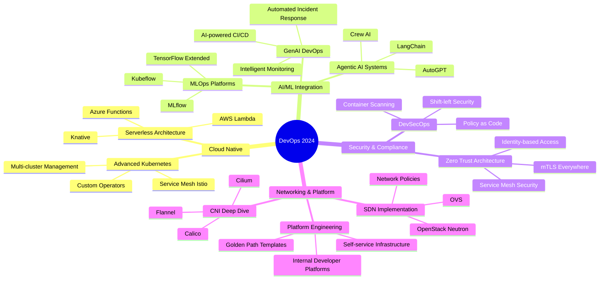

# <div align="center"></div>

<div align="center">
  

[](https://github.com/kaushalacts-github)
[](https://www.linkedin.com/in/kaushalacts/)
[](https://kaushalacts.hashnode.dev/)

</div>

## <div align="center">🚀 **"Automating the Future, One Pipeline at a Time"** 🚀</div>

<div align="center">
  
</div>

---

## 🎯 **Current Focus & Expertise**

<table>
<tr>
<td width="50%">

### 🔥 **What I'm Building:**
- 🏗️ **Enterprise DevOps Pipelines** with GitOps
- ☁️ **Multi-Cloud Infrastructure** (AWS, Azure)
- 🤖 **AI/ML MLOps** Platforms & GenAI Integration
- 🔧 **Microservices Architecture** with Kubernetes
- 🛡️ **Security-First** Infrastructure (DevSecOps)
- 🌐 **NetDevOps** & Network Automation

</td>
<td width="50%">

### 🎓 **Currently Mastering:**
- 🚀 **Advanced Kubernetes** & Service Mesh
- 🧠 **Agentic AI** & GenAI Integration
- 🌐 **Linux Networking** & SDN
- 📊 **Observability** & SRE Practices
- 🔐 **DevSecOps** & Zero Trust Architecture
- ⚡ **Platform Engineering** & Internal Tools

</td>
</tr>
</table>

---

## 🛠️ **Technology Arsenal**

<div align="center">

### ☁️ **Cloud Platforms & Services**
<p>


</p>

### 🚀 **DevOps & CI/CD**
<p>


</p>

### 📊 **Monitoring & Observability**
<p>


</p>

### 🔒 **Security & Compliance**
<p>


</p>

### 🐧 **Linux & Networking**
<p>


</p>

### 💻 **Development & APIs**
<p>


</p>

### 🤖 **AI/ML & GenAI**
<p>


</p>

</div>

---

## 📊 **Real-Time GitHub Analytics Dashboard**

<div align="center">
<table>
<tr>
<td>

</td>
<td>

</td>
</tr>
<tr>
<td colspan="2" align="center">

</td>
</tr>
</table>
</div>

---

## 🏆 **Achievement Showcase**

<div align="center">

</div>

---

## 📈 **Contribution Heatmap**

<div align="center">

</div>

---

## 📚 **Latest Blog Posts & Content**

<div align="center">

### 📝 **Recent Hashnode Articles**
<!-- HASHNODE:START -->
[](https://kaushalacts.hashnode.dev/)

🚀 **Building Production-Ready Kubernetes Clusters with GitOps**  
🤖 **Implementing MLOps Pipelines with ArgoCD and Kubernetes**  
🛡️ **Zero-Trust Security in Cloud-Native Applications**  
🌐 **Advanced Linux Networking for DevOps Engineers**  
⚡ **Infrastructure as Code: Terraform vs Pulumi Comparison**
<!-- HASHNODE:END -->

### 🎥 **Video Content & Tutorials**
[](https://www.youtube.com/@kaushalacts)

</div>

---

## 🎯 **Certifications & Achievements**

<div align="center">

### 🏅 **Current Certifications**


### 🎯 **Next Targets**
- 🚀 **AWS Solutions Architect Associate**
- ☸️ **Certified Kubernetes Administrator (CKA)**
- 🔒 **Certified Ethical Hacker (CEH)**
- 🐧 **Red Hat Certified Engineer (RHCE)**

</div>

---

## 🚀 **Featured Projects & Architecture**

<div align="center">

### 🎯 **Enterprise DevOps Solutions**

[](https://github.com/kaushalacts/k8s-infrastructure)
[](https://github.com/kaushalacts/devops-pipeline)

### 🤖 **AI/ML & GenAI Projects**

[](https://github.com/kaushalacts/ai-mlops-platform)
[](https://github.com/kaushalacts/genai-devops)

</div>

---

## 🌟 **DevOps Philosophy & Architecture**

<div align="center">

```yaml
apiVersion: devops/v1
kind: Philosophy
metadata:
  name: kaushal-kishore-mindset
  namespace: cloud-native
spec:
  principles:
    - "Infrastructure as Code is not optional"
    - "Automate everything, question nothing manual"
    - "Monitoring is love, Observability is life"
    - "Security first, performance second, features third"
    - "Fail fast, learn faster, deploy fastest"
    - "GitOps: Git is the single source of truth"
  technologies:
    container_orchestration: "Kubernetes with Service Mesh"
    cloud_strategy: "Multi-cloud with AWS & Azure"
    cicd_philosophy: "GitOps with ArgoCD"
    monitoring_stack: "Prometheus + Grafana + ELK + Jaeger"
    infrastructure: "Terraform + Ansible + Helm"
    security: "DevSecOps with OWASP + Trivy + Falco"
    ai_integration: "MLOps with GenAI capabilities"
    networking: "CNI + Service Mesh + NetDevOps"
  values:
    automation: 100
    security: 95
    observability: 90
    scalability: 95
    reliability: 98
```

</div>

---

## 💻 **Real-Time Coding Activity**

<div align="center">

<!--START_SECTION:waka-->
**📊 This week I spent my time on:**

```text
Terraform     12 hrs 30 mins  ████████████░░░░░░░░░░░░░   45.2%
Python        8 hrs 15 mins   ████████░░░░░░░░░░░░░░░░░   30.1%
YAML          4 hrs 20 mins   ████░░░░░░░░░░░░░░░░░░░░░   15.8%
Bash          2 hrs 10 mins   ██░░░░░░░░░░░░░░░░░░░░░░░    7.9%
Dockerfile    20 mins         ░░░░░░░░░░░░░░░░░░░░░░░░░    1.0%
```

**🔥 Editors:**
```text
VS Code       22 hrs          ████████████████████░░░░░   80.0%
Vim           4 hrs           ███░░░░░░░░░░░░░░░░░░░░░░   14.5%
Terminal      1.5 hrs         █░░░░░░░░░░░░░░░░░░░░░░░░    5.5%
```

**💼 Operating System:**
```text
Linux         20 hrs          ██████████████████░░░░░░░   72.7%
MacOS         7.5 hrs         ██████░░░░░░░░░░░░░░░░░░░   27.3%
```
<!--END_SECTION:waka-->

</div>

---

## 🎯 **2024 Goals & Roadmap**

<div align="center">



</div>

---

## 🤝 **Connect & Collaborate**

<div align="center">

### 🌐 **Professional Network**

[](https://www.linkedin.com/in/kaushalacts/)
[](https://kaushalacts.hashnode.dev/)
[](https://github.com/kaushalacts)
[](mailto:kaushalkishoremnt2000@gmail.com)

### 🚀 **Collaboration Opportunities**
```yaml
looking_for:
  - open_source_devops_projects: true
  - ai_ml_infrastructure_consulting: true
  - tech_mentoring: true
  - enterprise_devops_solutions: true
  - speaking_opportunities: true
  - technical_writing: true
```

### 💡 **Current Interests**
- 🤖 **Agentic AI in DevOps** - Building intelligent automation
- 🌐 **NetDevOps** - Network automation and programmability  
- 🔒 **Zero Trust Security** - Cloud-native security patterns
- ⚡ **Platform Engineering** - Developer experience optimization
- 📊 **Observability Engineering** - Advanced monitoring strategies

</div>

---

## 📈 **Live Stats Dashboard**

<div align="center">


**⚡ Quick Stats:**
- 🔥 **Current Streak:** 15 days of coding
- 💻 **Lines of Code:** 50K+ this year
- 🚀 **Projects:** 25+ repositories
- 📚 **Blog Posts:** 12+ technical articles
- 🎯 **Focus:** DevOps + AI + Cloud + Networking

</div>

---

## 🎬 **Dynamic Showcase**

<div align="center">

### 💫 **DevOps in Action**


### 🔄 **Continuous Learning Journey**


</div>

---

<div align="center">


### 🚀 **"Building Tomorrow's Infrastructure Today"** 🚀

**💜 Let's connect and build amazing things together! 💜**


</div>
