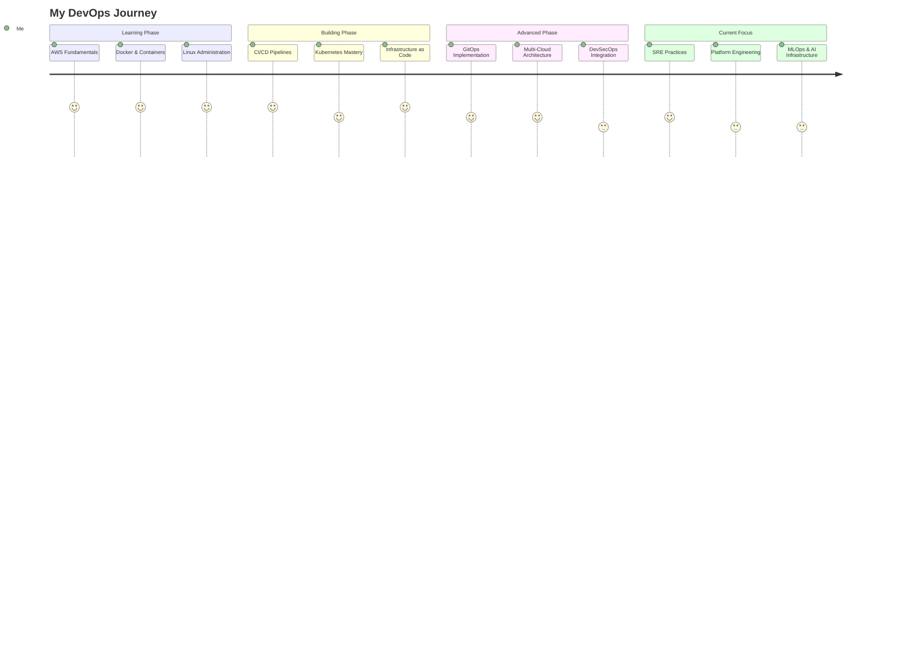

# 👋 Hey there! I'm Kaushal Kishore

<div align="center">

```ascii
╔═══════════════════════════════════════════════════════════════╗
║                                                               ║
║   ██████╗ ███████╗██╗   ██╗ ██████╗ ██████╗ ███████╗        ║
║   ██╔══██╗██╔════╝██║   ██║██╔═══██╗██╔══██╗██╔════╝        ║
║   ██║  ██║█████╗  ██║   ██║██║   ██║██████╔╝███████╗        ║
║   ██║  ██║██╔══╝  ╚██╗ ██╔╝██║   ██║██╔═══╝ ╚════██║        ║
║   ██████╔╝███████╗ ╚████╔╝ ╚██████╔╝██║     ███████║        ║
║   ╚═════╝ ╚══════╝  ╚═══╝   ╚═════╝ ╚═╝     ╚══════╝        ║
║                                                               ║
║          🚀 Cloud Native Engineer | GitOps Enthusiast        ║
║                                                               ║
╚═══════════════════════════════════════════════════════════════╝
```


[](https://github.com/kaushalacts)
[](https://github.com/kaushalacts?tab=followers)
[](https://www.linkedin.com/in/kaushalacts/)
[](mailto:kaushalkishoremnt2000@gmail.com)

</div>

---

## 🚀 About Me

```python
class DevOpsEngineer:
    def __init__(self):
        self.name = "Kaushal Kishore"
        self.role = "DevOps Engineer & Cloud Architect"
        self.location = "India 🇮🇳"
        self.languages = ["Python", "Go", "Bash", "JavaScript"]
        self.current_focus = [
            "Building enterprise GitOps pipelines",
            "Multi-cloud infrastructure automation",
            "Kubernetes & Service Mesh",
            "DevSecOps implementation"
        ]
    
    def say_hi(self):
        print("Thanks for dropping by! Let's build something amazing together!")

me = DevOpsEngineer()
me.say_hi()
```

<details>
<summary>📈 <b>Click to see my journey timeline</b></summary>
<br>



</details>

---

## 🔥 What I'm Currently Working On

<table>
<tr>
<td width="50%">

### 🏗️ **Active Projects**
```yaml
current_projects:
  - name: "Enterprise GitLab CI/CD Pipeline"
    tech: [GitLab, Docker, Kubernetes, EKS]
    status: "🟢 Production Ready"
    
  - name: "Multi-Cloud Terraform Modules"
    tech: [Terraform, AWS, Azure, GCP]
    status: "🟡 In Progress"
    
  - name: "Kubernetes Security Automation"
    tech: [K8s, Trivy, OPA, Falco]
    status: "🟡 In Progress"
```

</td>
<td width="50%">

### 🎯 **Learning Goals**
```yaml
current_learning:
  focus_areas:
    - "Advanced Kubernetes (CKA/CKAD prep)"
    - "Site Reliability Engineering"
    - "Platform Engineering & IDP"
    - "FinOps & Cloud Cost Optimization"
    - "Network Automation (NetDevOps)"
    
  next_certifications:
    - "AWS Solutions Architect Associate"
    - "Certified Kubernetes Administrator"
    - "HashiCorp Terraform Associate"
```

</td>
</tr>
</table>

---

## 🛠️ Technology Arsenal

<details open>
<summary><b>☁️ Cloud Platforms</b></summary>
<br>


**Expertise Level:**
```
AWS             ████████████████████░   95%
Azure           ███████████████░░░░░   75%
Google Cloud    ████████████░░░░░░░░   60%
```

</details>

<details open>
<summary><b>🚀 DevOps & CI/CD Tools</b></summary>
<br>


</details>

<details open>
<summary><b>📊 Monitoring & Observability</b></summary>
<br>


</details>

<details open>
<summary><b>🔐 Security & Compliance</b></summary>
<br>


</details>

<details open>
<summary><b>💻 Programming & Scripting</b></summary>
<br>


</details>

<details>
<summary><b>🗄️ Databases & Message Queues</b></summary>
<br>


</details>

---

## 📊 GitHub Analytics

<div align="center">


</div>

### 🏆 GitHub Trophies

<div align="center">


</div>

---

## 🎯 Professional Achievements

<table>
<tr>
<td width="50%">

### 📜 **Certifications Earned**
```
✅ Microsoft Azure AI Fundamentals
✅ Microsoft Azure Fundamentals  
✅ AWS Cloud Practitioner
✅ Kubernetes Fundamentals
✅ Docker Certified Associate (Prep)
```

</td>
<td width="50%">

### 🎓 **Next Certification Goals**
```
🎯 AWS Solutions Architect Associate (Q1 2025)
🎯 Certified Kubernetes Administrator (Q1 2025)
🎯 HashiCorp Terraform Associate (Q2 2025)
🎯 Red Hat Certified Engineer (Q2 2025)
```

</td>
</tr>
</table>

---

## 💼 Featured Projects

<details open>
<summary><b>🚀 Production-Ready Projects</b></summary>
<br>

### 1. 🔄 [GitLab CI/CD Pipeline with DevSecOps](https://gitlab.com/kaushalacts/3-tier-gitlab)
```yaml
Description: Enterprise-grade CI/CD pipeline for 3-tier Node.js application
Tech Stack: GitLab CI/CD, Docker, Kubernetes, AWS EKS, Trivy, SonarQube
Features:
  - ✅ Automated security scanning (Gitleaks, Trivy)
  - ✅ Code quality analysis with SonarQube
  - ✅ GitOps-based deployment strategy
  - ✅ Zero-downtime rolling updates
Status: 🟢 Production Ready
Impact: 85% faster deployments, <2% failure rate
```

### 2. ☁️ Multi-Cloud Infrastructure as Code
```yaml
Description: Reusable Terraform modules for AWS, Azure, and GCP
Tech Stack: Terraform, AWS, Azure, GCP, Terragrunt
Features:
  - ✅ Multi-cloud abstraction layer
  - ✅ Cost optimization built-in
  - ✅ Security best practices enforced
  - ✅ Automated compliance checks
Status: 🟡 In Progress
```

### 3. 🛡️ Kubernetes Security Automation
```yaml
Description: Automated security scanning and policy enforcement for K8s
Tech Stack: Kubernetes, Trivy, OPA, Falco, Prometheus
Features:
  - ✅ Runtime security monitoring
  - ✅ Automated vulnerability remediation
  - ✅ Policy as Code implementation
  - ✅ Security audit trails
Status: 🟡 In Progress
```

</details>

---

## 📝 Latest Blog Posts & Articles

<!-- BLOG-POST-LIST:START -->
- 🚀 **Building Production-Ready GitLab CI/CD Pipelines** - [Read More](#)
- 🔐 **DevSecOps: Shift-Left Security in Practice** - [Read More](#)
- ☸️ **Kubernetes Cost Optimization: A Practical Guide** - [Read More](#)
- 🌐 **Multi-Cloud Strategy: When and Why** - [Read More](#)
<!-- BLOG-POST-LIST:END -->

---

## 📈 Contribution Activity

<div align="center">


</div>

---

## 🤝 Let's Collaborate!

<div align="center">

### 💡 **Open to:**

```diff
+ DevOps & Cloud Architecture consulting
+ Open source project contributions
+ Technical mentorship and knowledge sharing
+ Speaking at tech conferences and meetups
+ Collaborating on innovative cloud-native projects
```

### 📫 **Reach Out:**

<a href="https://www.linkedin.com/in/kaushalacts/">
  
</a>
<a href="https://github.com/kaushalacts">
  
</a>
<a href="mailto:kaushalkishoremnt2000@gmail.com">
  
</a>
<a href="https://twitter.com/kaushalacts">
  
</a>

</div>

---

## 💭 Random Dev Quote

<div align="center">


</div>

---

## 🎵 Spotify Playing

<div align="center">

[](https://open.spotify.com/user/kaushalacts)

</div>

---

<div align="center">

### 🌟 **"Automating the Future, One Pipeline at a Time"** 🚀

```ascii
┌─────────────────────────────────────────────────┐
│                                                 │
│  💻 Code → 🔧 Build → 🧪 Test → 🚀 Deploy     │
│                                                 │
│         "Infrastructure as Poetry"              │
│                                                 │
└─────────────────────────────────────────────────┘
```


**⭐ If you like my work, consider giving a star to my repositories!**

</div>
